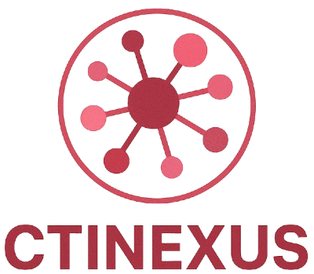
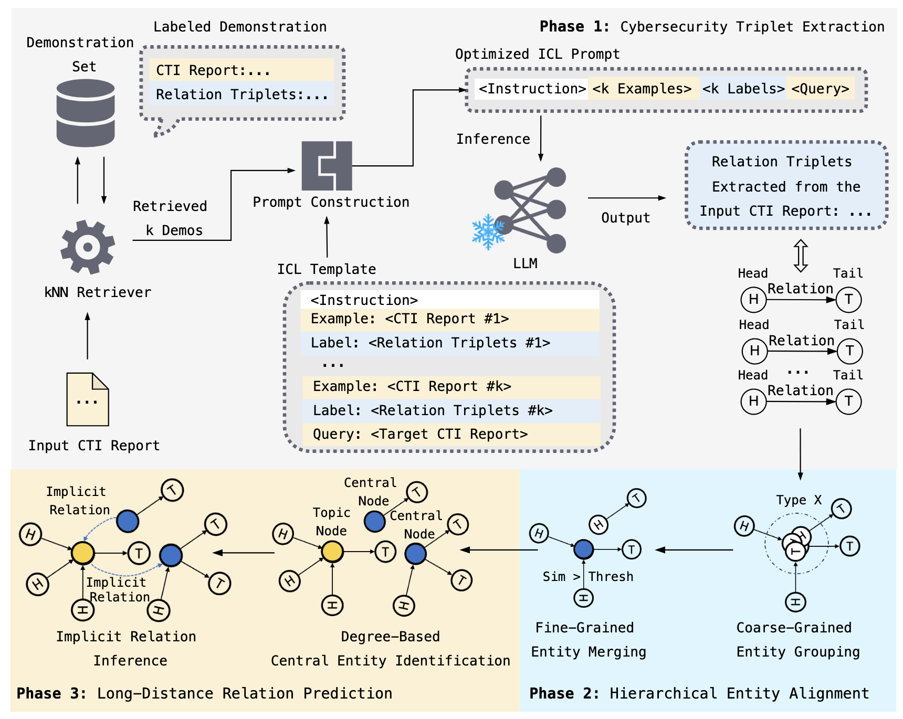

# CTINexus



**CTINexus** constructs cybersecurity knowledge graphs from unstructured threat reports using large language models (LLMs). It combines optimized prompts with hierarchical entity alignment and link prediction to produce rich entity-relation graphs.



## Features

- **Containerized web UI** built with Gradio for interactive processing and graph visualisation
- **CLI pipeline** for batch workflows and automation
- **Cross-provider LLM support**: OpenAI, Gemini, AWS Bedrock, Claude, Perplexity and local Ollama models
- **File and URL ingestion**: process `.txt`, `.md`, `.pdf` or fetch content directly from remote URLs
- **Entity typing, merging and link prediction** with configurable models and similarity thresholds

## Installation

### Using Docker

```bash
# Clone repository
git clone https://github.com/peng-gao-lab/CTINexus.git
cd CTINexus

# Copy environment variables template and edit API keys
cp .env.example .env
vi .env

# Build and start container
docker-compose up --build
```

The Gradio interface will be available at `http://localhost:8000`.
To stop the container:

```bash
docker-compose down
```

### Local Python Setup

```bash
# Clone repository
git clone https://github.com/peng-gao-lab/CTINexus.git
cd CTINexus
cp .env.example .env

# Python 3.11+ virtual environment
python -m venv .venv
source .venv/bin/activate  # on Windows use .venv\Scripts\activate

pip install -r requirements.txt
python app/app.py
```

Access the web UI at `http://127.0.0.1:7860`. Stop with `Ctrl+C`.

## Command Line Usage

The CLI supports all processing steps with explicit model selection.

```bash
python app/app.py --input-file report.txt --provider OpenAI --model gpt-4o --embedding-model text-embedding-3-large
```

See [CLI Guide](app/docs/cli-guide.md) for the complete option list.

## Citation

```bibtex
@inproceedings{cheng2025ctinexusautomaticcyberthreat,
      title={CTINexus: Automatic Cyber Threat Intelligence Knowledge Graph Construction Using Large Language Models},
      author={Yutong Cheng and Osama Bajaber and Saimon Amanuel Tsegai and Dawn Song and Peng Gao},
      booktitle={2025 IEEE European Symposium on Security and Privacy (EuroS\&P)},
      year={2025},
      organization={IEEE}
}
```

## License

Source code is licensed under the [MIT](LICENSE.txt) license. For collaborations please contact yutongcheng@vt.edu or saimon.tsegai@vt.edu.
